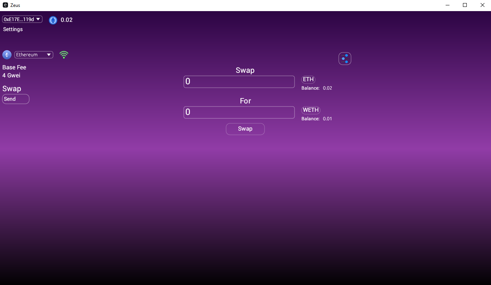

## Zeus - An Ethereum Desktop Wallet App (WIP)





### This project is under heavy development and doesnt carry any useful functionalities yet.


### Currently you can do:
- Create, import wallets
- Add Erc20 tokens from their address
- See your Eth and Erc20 token balances

### Supports the following chains:
- Ethereum Mainnet
- Binance Smart Chain
- OP Base
- Arbitrum

You need to provide your own RPC url in order for Zeus to make requests, to do that you can find the Network settings at the top left corner.

Currently only supports Websockets.

## Build From Source
```
cargo build --release
```